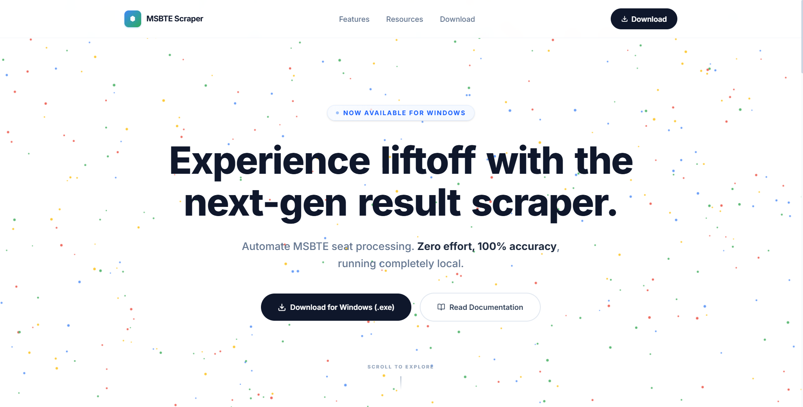

# MSBTE Master Scraper Landing Page
> Landing page and documentation portal for the MSBTE Master Scraper desktop application.

[](https://nextjs.org/)
[](https://www.typescriptlang.org/)
[](https://tailwindcss.com/)
[](https://www.framer.com/motion/)

---

## Preview



---

### Important Notice
> [!IMPORTANT]
> This repository contains **only the marketing, landing page, and documentation website** for the tool. For the actual desktop application source code and releases, see the **[msbte-result-scraper-v3](https://github.com/prajwal-2509/msbte-result-scraper-v3)** repository.

* **Live Deployed Site:** [https://msbte-exe-download-web.vercel.app](https://msbte-exe-download-web.vercel.app/)
* **Desktop App Repository:** [prajwal-2509/msbte-result-scraper-v3](https://github.com/prajwal-2509/msbte-result-scraper-v3)

---

## Tech Stack

The landing page is built using a modern frontend stack:
* **Framework:** Next.js 16 (App Router)
* **Language:** TypeScript
* **Styling:** Tailwind CSS 4
* **Animations:** Framer Motion (for transitions, live grids, and faq accordions)
* **Icons:** Lucide React
* **Background Effect:** HTML5 Canvas (rendering a responsive, high-density particle cluster reacting to mouse interactions)

---

## Pages & Routes Overview

* **`/` (Homepage):** Features download portals, PyQt desktop application status mockups, dynamic worker-grid transitions, interactive Excel formatting sheet displays, and badges for system requirements.
* **`/guide` (Installation Guide):** Step-by-step documentation detailing system prerequisites, installation steps, and first-scrape tutorial guides.
* **`/troubleshooting` (Help & FAQs):** Expandable FAQ accordion addressing Windows Defender notifications, captcha solving delays, antivirus warnings, and download errors.
* **`/privacy` (Data Privacy Policy):** Outlines policies regarding local student data storage (SQLite), telemetry registration tracking, and legal usage responsibilities.

---

## Project Structure

```
nextjs-app/
├── app/
│   ├── guide/
│   │   └── page.tsx           # Step-by-step installation, prerequisites, and first scrape tutorial.
│   ├── privacy/
│   │   └── page.tsx           # Telemetry information, SQLite local storage details, and user compliance.
│   ├── troubleshooting/
│   │   └── page.tsx           # Interactive FAQ accordion addressing Windows Defender, OCR lag, and retry behaviors.
│   ├── globals.css            # Tailwind CSS 4 global style imports.
│   ├── layout.tsx             # Root layout setting up document structure, global font, and metadata.
│   └── page.tsx               # Homepage featuring dynamic worker status grids, results sheet mockups, and resource links.
```

---

## Local Development

To run the landing page project locally, follow these steps:

1. Clone the repository:
   ```bash
   git clone https://github.com/prajwal-2509/MSBTE-exe-Download-Web.git
   ```

2. Navigate to the Next.js app directory:
   ```bash
   cd MSBTE-exe-Download-Web/nextjs-app
   ```

3. Install dependencies:
   ```bash
   npm install
   ```

4. Run the dev server:
   ```bash
   npm run dev
   ```

5. Open http://localhost:3000 in your browser.

To compile a production build of the website, run:
```bash
npm run build
```

---

## Deployment

This site is deployed on Vercel with automatic deployments triggered on every push to the main branch. 

To deploy your own copy: import this repository at vercel.com, Vercel will auto-detect the Next.js framework and handle the build configuration automatically.

---

## License

Distributed under the MIT License - see the LICENSE file in this repository for details.

---

## Disclaimer

This landing page and the corresponding scraper are independent utility tools designed for academic data analysis. The application retrieves publicly accessible student result sheets from the official MSBTE web portal. Users are responsible for ensuring that their utilization of this tool complies with institutional regulations and MSBTE's terms of service.

---
Built with Next.js and deployed on Vercel.
